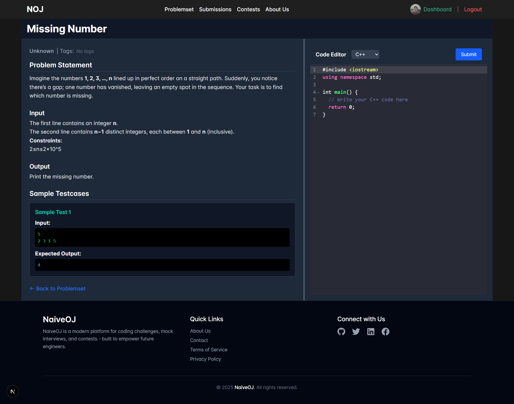
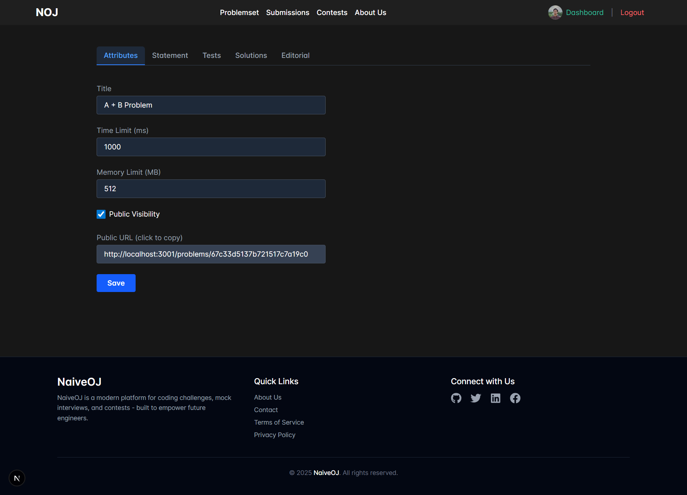
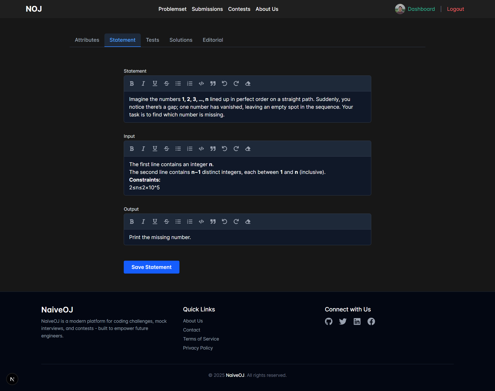
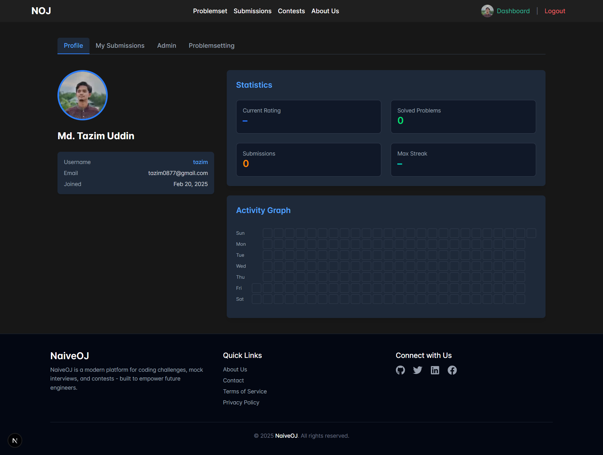
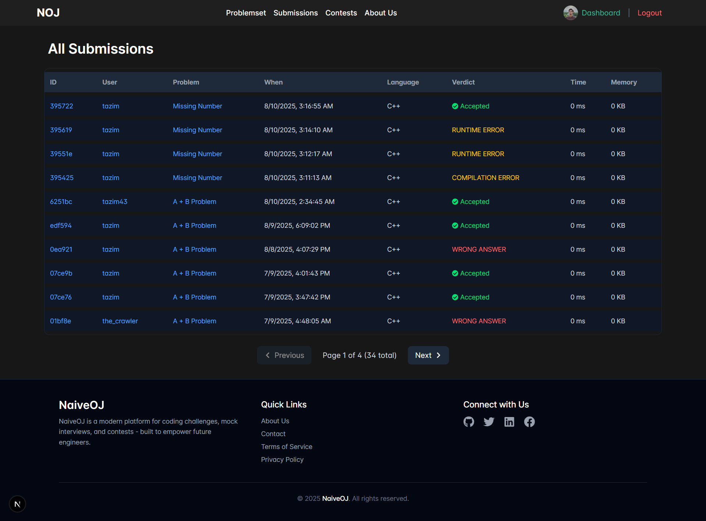
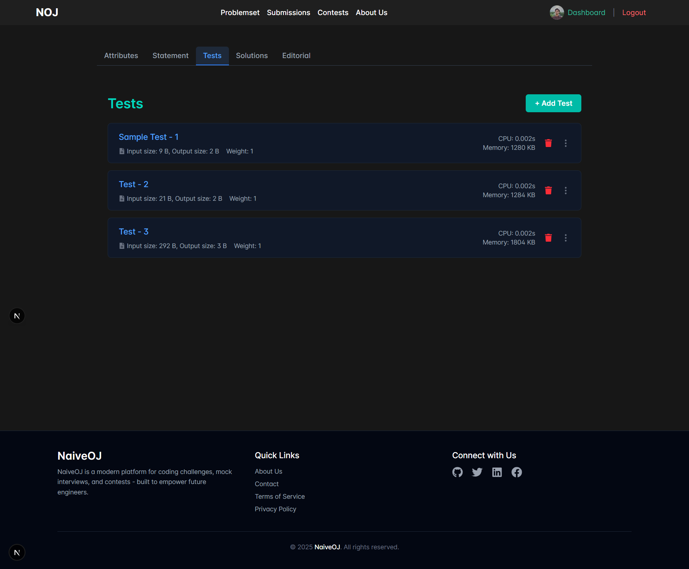
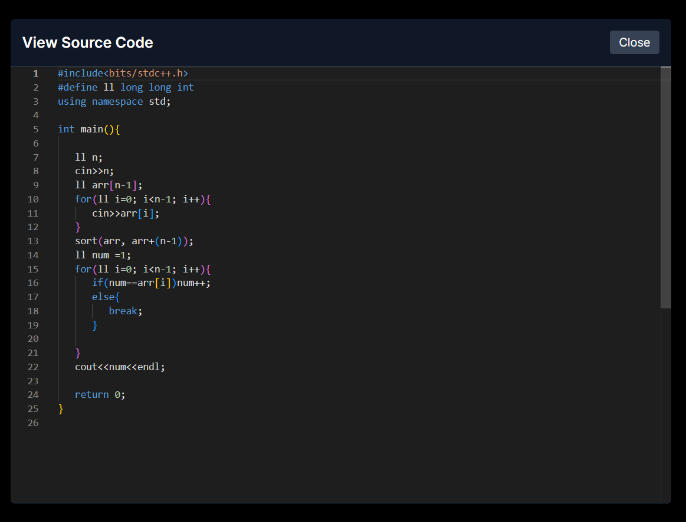

# NaiveOJ Frontend

A modern, responsive frontend for the NaiveOJ (Naive Online Judge) platform built with Next.js and modern web technologies.

## 🚀 Overview

NaiveOJ Frontend is a comprehensive web application that provides an intuitive interface for competitive programming enthusiasts. The platform offers a seamless experience for solving coding problems, participating in contests, managing submissions, and tracking progress.

## ✨ Features

### 🔐 Authentication & User Management

- Secure user registration and login
- JWT-based authentication with persistent sessions
- User profile management
- Role-based access control (User, Admin, Moderator)

### 📝 Problem Management

- Browse problems with advanced filtering
- Difficulty-based categorization
- Tag-based problem organization
- Problem statement viewer with rich text support
- Visual indicators for solved problems
- Problem creation and editing (for authorized users)

### 💻 Code Submission & Judging

- Multi-language code editor with syntax highlighting
- Real-time submission status tracking
- Detailed verdict display (Accepted, Wrong Answer, TLE, etc.)
- Submission history and analytics
- Code comparison and review tools

### 🏆 Contest System

- Participate in timed programming contests
- Live leaderboards and rankings
- Contest-specific problem sets
- Performance analytics and statistics

### 📊 Analytics & Progress Tracking

- Personal dashboard with submission statistics
- Problem-solving progress visualization
- Performance metrics and trends
- Achievement tracking

### ⚡ Advanced Features

- Responsive design for all devices
- Dark/Light theme support
- Real-time notifications
- Advanced search and filtering
- Code syntax highlighting
- File upload support for bulk operations

## 🛠️ Tech Stack

- **Framework**: [Next.js 14](https://nextjs.org/) with App Router
- **Language**: JavaScript/TypeScript
- **Styling**: [Tailwind CSS](https://tailwindcss.com/)
- **State Management**: [Redux Toolkit](https://redux-toolkit.js.org/) with RTK Query
- **Code Editor**: [Monaco Editor](https://microsoft.github.io/monaco-editor/) & [CodeMirror](https://codemirror.net/)
- **Icons**: [React Icons](https://react-icons.github.io/react-icons/)
- **HTTP Client**: RTK Query with built-in caching
- **Build Tool**: Next.js built-in bundler
- **Package Manager**: npm/yarn

## 📱 Screenshots

### Homepage


_Modern and intuitive landing page showcasing platform overview and quick access to core features._

### Problem Page



_Individual problem interface with detailed statement and integrated code submission functionality._

### Problem Settings Page



_Administrative interface for configuring problem parameters and test case management._

### Problem Statement Page



_Clean and focused problem statement viewer with comprehensive problem details and constraints._

### User Profile



_Personalized user profile displaying statistics, achievements, and account information._

### Submission Details


_Detailed submission analysis with verdict, execution metrics, and code review capabilities._

### Submissions Page



_Comprehensive submission history with filtering options and performance analytics._

### Test Case Page



_Test case management interface for problem creators and administrators._

### View Source Modal



_Code viewing modal with syntax highlighting and comparison tools for submission analysis._

## 🚀 Getting Started

### Prerequisites

- Node.js 18.x or higher
- npm or yarn package manager
- Modern web browser

### Installation

1. **Clone the repository**

   ```bash
   git clone <repository-url>
   cd noj-frontend
   ```

2. **Install dependencies**

   ```bash
   npm install
   # or
   yarn install
   ```

3. **Environment Setup**

   Create a `.env.local` file in the root directory:

   ```env
   NEXT_PUBLIC_API_BASE_URL=http://localhost:3000/api/v1
   NEXT_PUBLIC_APP_NAME=NaiveOJ
   ```

4. **Run the development server**

   ```bash
   npm run dev
   # or
   yarn dev
   ```

5. **Open your browser**

   Navigate to [http://localhost:3001](http://localhost:3001)

### Build for Production

```bash
# Build the application
npm run build

# Start the production server
npm run start
```

## 📁 Project Structure

```
src/
├── app/                    # Next.js App Router pages
│   ├── admin/             # Admin panel pages
│   ├── auth/              # Authentication pages
│   ├── contest/           # Contest-related pages
│   ├── create-problem/    # Problem creation pages
│   ├── problemset/        # Problem listing and details
│   ├── profile/           # User profile pages
│   └── submissions/       # Submission pages
├── components/            # Reusable UI components
│   ├── Buttons/          # Button components
│   ├── Editor/           # Code editor components
│   ├── Modals/           # Modal components
│   └── Navigation/       # Navigation components
├── store/                # Redux store configuration
│   ├── services/         # RTK Query API services
│   └── slices/           # Redux slices
├── styles/               # Global styles and Tailwind config
└── utils/                # Utility functions and helpers
```

## 🔧 Available Scripts

- `npm run dev` - Start development server
- `npm run build` - Build for production
- `npm run start` - Start production server
- `npm run lint` - Run ESLint
- `npm run lint:fix` - Fix ESLint issues
- `npm run type-check` - Run TypeScript type checking

## 🌟 Key Components

### Authentication System

- JWT-based authentication with secure cookie storage
- Automatic token refresh and session management
- Protected routes and role-based access control

### Problem Interface

- Rich text problem statements with image support
- Multi-language code editor with themes
- Real-time submission tracking and results

### Contest System

- Live contest participation with timer
- Dynamic leaderboard updates
- Contest-specific problem sets and rankings

### Admin Dashboard

- User management and role assignment
- System statistics and monitoring
- Content management and moderation tools

## 🤝 Contributing

1. Fork the repository
2. Create a feature branch (`git checkout -b feature/amazing-feature`)
3. Commit your changes (`git commit -m 'Add amazing feature'`)
4. Push to the branch (`git push origin feature/amazing-feature`)
5. Open a Pull Request

## 📝 Code Style Guidelines

- Use ESLint and Prettier for code formatting
- Follow React/Next.js best practices
- Use TypeScript for type safety
- Write meaningful commit messages
- Add comments for complex logic

## 🔒 Security Features

- XSS protection with proper sanitization
- CSRF protection for form submissions
- Secure authentication flow
- Input validation and sanitization
- Rate limiting for API calls

## 📈 Performance Optimizations

- Next.js automatic code splitting
- Image optimization with Next.js Image component
- RTK Query caching for API responses
- Lazy loading for heavy components
- Optimized bundle size with tree shaking

## 🐛 Known Issues & Limitations

- [List any known issues or limitations here]
- [Performance considerations for large datasets]
- [Browser compatibility notes]

## 📄 License

This project is licensed under the MIT License - see the [LICENSE](LICENSE) file for details.

## 🙏 Acknowledgments

- Built with [Next.js](https://nextjs.org/)
- UI components styled with [Tailwind CSS](https://tailwindcss.com/)
- Code editing powered by [Monaco Editor](https://microsoft.github.io/monaco-editor/)
- Icons provided by [React Icons](https://react-icons.github.io/react-icons/)

## 📞 Support

For support, please open an issue in the repository or contact the development team.

---

**Note**: This is the frontend application for NaiveOJ. For the complete system, you'll also need to set up the [backend API](../NOJ%20Backend/) and judging system.
